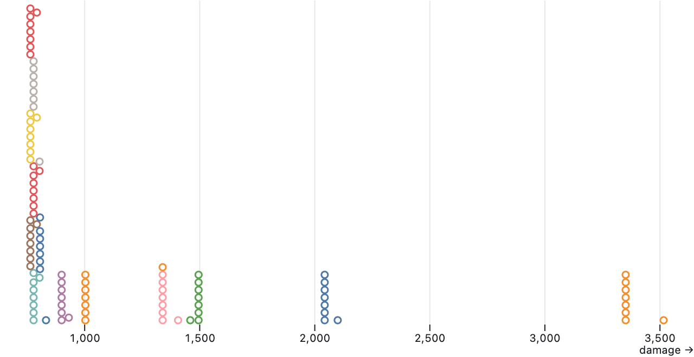

+++
title = '#achaea Tekura analysis'
intro = "Which is the best stance? Under what circumstances does that change? Does any of the punches, kicks, or throws outperform the others? Let's analyse it and see what the numbers say."
game = 'Achaea'
draft = true
+++

I play a monk in Achaea and wanted to know how the different attacks compare to each other and how they're modified by the various stances. This is theorycraft at its finest but I hope you find it useful!

The methodology was simple. Mhaldor infernal Totto generously let me hit him for a total of 459 punches, kicks, and throws. Over a total of 1'458 seconds of balance I dealt 112'563 damage and broke 23 limbs.

Totto is a Xoran with 6472 health. Before starting, he removed his armour and we both relaxed our defenses, so as to avoid any potential confounders. Timing is measured with server-side timestamps and should be unaffected by network latency.

I took detailed notes of each attack, compiled a spreadsheet of the data, and then went to analysing it. Here's what I found.

*Disclaimer: There are many gaps in this analysis (which I hope to fill with time). Most importantly, the absolute values for damage are useless for a general prediction. They are the result of a calculation for only one very specific case and say nothing of how they scale with various modifiers. Only look at the values herein relative to each other.*

Further, this analysis only covers damage and balance. It doesn't include accuracy, which would affect the total damage output by some unknown factor, nor block rate or any other defensive measure.

I suspect that accuracy is a little more complicated to measure because of problems with observability. With damage you can see discrete changes immediately but for accuracy you can only see the binary result of a probability test. It would probably require several hundred attacks per attack/stance combination to get reliable numbers, which would take many, many hours. So I leave that for a later time.

Want to be notified on updates to the Nogfx guides? [Subscribe now!](/subscribe/)

## Findings

Before diving into the result details, here are some general take-aways.

*Consider my commentary that of an amateur. I've got extensive PvP experience from another IRE game but I'm still relatively new to Achaea and have plenty yet to learn. Please let me know if I got anything wrong!*

### Static damage

One surprising thing I found was how static the damage was. If a punch dealt 386 damage and 11.7% limb damage, the next five punches did exactly the same damage. No variability whatsoever.

Of course, damage *is* variable. If Totto put on his armour, if I hit another person, or if I had wielded artefact knuckles, the damage would change. But within the same constraints, damage stays constant.

Plotting this on a graph we can see how static the damage is.

Each circle represents the combination of a stance and attack and its color indicates the attack. The orange circles, for example, are for Backbreaker and they're all stacked with exactly the same damage, except for one, showing the advantage of Backbreaker in Bear stance.

<figure class="figure">
  
  <figcaption class="figure-caption text-end">BACKBREAKER is a bitch, dealing twice the damage of the runner-up</figcaption>
</figure>

Plotting the *limb damage* instead, we see how that's even more static.

<figure class="figure">
  
  <figcaption class="figure-caption text-end">AXE will easily break your head in just two hits.</figcaption>
</figure>

Which is great! Else it'd be a lot harder to plan your offense. ;)

### Stance switch

Another surprise was that it costs nothing to switch stance after a combo, even if you delay the switch! In my tests, switching stance takes ~1.75 seconds but performed while off balance from a combo, it's free.

This means you can execute your attack, determine its effects, plan you subsequent attack, and switch to the appropriate stance just before you regain balance, without delaying anything.

We use the balance queue anyway, to chain our attacks together as rapidly as possible, so we might as well throw in a switch to the most beneficial stance while we're at it.

### Superior stance

Another finding was how superior two stances are compared to all else. They seem to be the foundational stances for the majority of cases, with two (potentially three) edge-case specializations.

Total damage output is a function of damage and speed – twice the damage with half the speed equals the same output. Plotting damage per second (DPS) of the punches and kicks we can see how the attacks start differentiating depending on what stance they're performed in:

<figure class="figure">
  
  <figcaption class="figure-caption text-end">Stances do make a difference on damage over time.</figcaption>
</figure>

## Stances

Since stances modify so many aspects of the attacks from which they are performed, let's begin there.

There are seven stances: [Horse](#horse-stance-small-classtext-mutedhrssmall), [Eagle](#eagle-stance-small-classtext-mutedegssmall), [Cat](#cat-stance-small-classtext-mutedctssmall), [Bear](#bear-stance-small-classtext-mutedbrssmall), [Rat](#rat-stance-small-classtext-mutedrtssmall), [Scorpion](#scorpion-stance-small-classtext-mutedscssmall), and [Dragon](#dragon-stance-small-classtext-muteddrssmall). You can also be without a stance so in total we have eight scenarios to compare to each other and see how they differ.

Stances can modify your attacks by affecting their damage, speed, accuracy, combinations, or even granting special or passive attacks!

Some stances also modify your defense through block rate.

With all these variables, the one number I think compared the stances well was their DPS – damage per second. It combines damage and speed into one, showing us the potential for total damage output.

Plotting our attacks on a graph, grouped by stance, shows us roughly three tiers of stances, with Scorpion and Eagle coming out on top, and with Bear lagging behind the rest (more on this later):

<figure class="figure">
  
  <figcaption class="figure-caption text-end">Pay special attention to the tick, indicating average damage output.</figcaption>
</figure>

Plotting the same data in a candle chart shows something interesting.

<figure class="figure">
  
  <figcaption class="figure-caption text-end">Eagle and Scorpion kick ass in the DPS department.</figcaption>
</figure>

Again, Scorpion and Eagle stand out for two reasons:

1. They both have a higher top-end damage (the thin line extends further to the right). That's the Axe kick which has a higher DPS in EGS and SCS, due to their speed.

2. They both have a more consistent damage output (the colored bar being shorter, with a higher low-end). This graph makes it clear that the stances' different averages is mainly a function of different DPSes in their low-end attacks.

Scorpion does come out slightly ahead of Eagle, in terms of damage output, but it also comes with a defensive drawback and it lacks the extra skill granted by Eagle. The other stances have their benefits – Bear for its decent damage boost and Horse for its surprising utility.

Just from this, there's no clear-cut, one-size-fits-all winner but you won't do badly defaulting to either Eagle or Scorpion.

Now, let's dive into the stances and their specifics.

### Horse stance <small class="text-muted">HRS</small>

The Horse stance enables us to LEAP over obstacles and to replace the kick in one of our combos with either WRENCH or SLAM.

```
The first stance any practitioner of tekura becomes proficient in, the horse stance is ideal for striking. This is demonstrated in the fact that in this stance alone, you are able to perform standard strikes in conjunction with the slam and wrench throws.

Additionally, due to the firm grounding of your feet in this stance, you are able to leap over obstructions in a given direction, although this will naturally break your stance.

Note that usually entering a tekura stance consumes and requires balance. However, those skilled in tekura are able to transition into a new stance immediately following a tekura kick or punch, although this will make your recovery period slightly slower.
```

Horse doesn't modify any damage variables and I have no idea whether LEAP is useful or not, so let's focus on the remaining perk: replacing kicks with Wrench or Slam in combos.

First out, it's worth noting that, just like kicks, Wrench or Slam has to go before the punches in a combo. That means the opponent has to either have broken arms, torso, or head for a Wrench combo to work or be prone for a Slam combo to work.

I'm probably missing something essential with how mind locks work but I fail to see the big deal with Slam. If the opponent is prone, why wouldn't you perform a Backbreaker instead? So with that out-of-hand dismissal, let's look at using Wrench in combos instead.

What kicks would you replace Wrench with?

One nice substitute could be for Sweep, which is used to prone the opponent and usually followed with Hammerfist to break the opponent's leg, preventing them from standing back up. On one hand Wrench requires one of their arms to be broken but, on the other, contrary to Sweep it deals damage (~1300 in my test). Plus, it's faster than Sweep!

If you precede that with Wrench to damage their torso and Spear to break their arms, you both pave the way for the above combo AND give them the bruised ribs affliction. This will let you instakill the target with only three Backbreakers, instead of the normal four.

One last combo that could be interesting is Wrench, followed by two Palmstrikes. This would give the epilepsy, impatience, and stupidity afflictions, all of which are cured by eating goldenseal/plumbum. I doubt it would stick, however, with little else to follow that up with and I'm not entirely sure what it would achieve.

Since it doesn't cost anything to switch stance while off balance, it seems like a waste not to switch to Horse when you know you'll use Wrench next, to get some free punches with the following combo.

### Eagle stance <small class="text-muted">EGS</small>

The Eagle stance decreases the balance cost of many attacks and it grants the Highkick attack, which brings down a target above you.

```
The stance of the eagle is geared towards flexibility and speed. Your kicks and punches will be faster when performed from this stance. Furthermore, you are able to perform the highkick ability from this stance, bringing down someone who may be above you in the trees or the skies. This ability will prone the unfortunate individual.
```

The Highkick is situationally useful in that it's basically a free Tentacle tattoo. It causes no damage and its balance cost is similar to Whirlwind.

The speed boost is more interesting! It alone places the Eagle stance in the top tier of stances based on total damage output. So it makes a real, tangible difference but just how much faster does it make you?

It depends on the attack. None of the throws are affected. Nor is Jumpkick, contrary to what the documentation says. The rest see a small but significant decrease in their balance cost.

Comparing the attacks in Eagle (blue bars) with no stance (white):

<figure class="figure">
  
  <figcaption class="figure-caption text-end">Eagle affects the speed slightly differently, depending on attack.</figcaption>
</figure>

On average we're seeing an improvement of 15.9% or 0.5 seconds.

So which is it, relative percentages or absolute seconds? Let's see!

First we plot the improvements by attack to see which is more even. A straighter line would likely mean it's closer to the truth. We also highlight the 80th percentile to see which type has more points inside.

<div class="row">
  <div class="col">
    <figure class="figure">
      
      <figcaption class="figure-caption text-end">Percentage-based.</figcaption>
    </figure>
  </div>
  <div class="col">
    <figure class="figure">
      
      <figcaption class="figure-caption text-end">Seconds-based.</figcaption>
    </figure>
  </div>
</div>

It's leaning slightly more towards a fixed seconds-based improvement, though there's no one clear winner. Comparing their standard deviations to their mean gives a 16.0% variability for percentage-based and 11.5% for seconds-based, again favouring the latter.

I'd guess the improvements are either too random for this small a sample or, more likely, it's a mix of one part absolute improvement and 

I'd guess the speed boost is a mix of one part fixed value and one part randomness. To verify that, however, we'd need a much bigger sample size. (And plenty more time, of which I'm already way above budget.)

For now, I'll go ahead and assume a 0.5 second boost from Eagle.

### Cat stance <small class="text-muted">CTS</small>

Cat is a defensive stance, which improves your block rate, lets you switch your guard off-balance, decreases your accuracy, and slows down your attacks.

```
The primary purpose of the cat stance is for facing those with formidable offensive capabilities. It grants superior defence, allowing one to block far more often than in other stances. However, you will find that it is more difficult to attack, and your attacks will be slower.
```

 I know too little to say anything about the off-balance guard perk and since I don't (yet) have data to analyse block rate or accuracy, I'll focus on the speed aspect of Cat. So just how slow is this stance?

 Let's compare the speed of attacks in Cat stance to no stance.

<figure class="figure">
  
  <figcaption class="figure-caption text-end">Cat makes you marginally slower in most attacks.</figcaption>
</figure>

On average it adds 0.25 seconds to affected attacks. The variability is large, at 35%, but that's to be expected with this small of an effect.

These even numbers are starting to make me think the formula behind them is probably quite a simple one. Maybe a base (0.5 for Eagle, 0.25 for Cat) and a small random number to modify that? A guess, at least.

Overall, Cat is a very defensive stance. We don't know exactly how big of a defensive boost it grants but the offensive blunting is at least partly clear. In my experience, the best defense actually really is a good offense, so I don't quite see this stance being useful for anything.

### Bear stance <small class="text-muted">BRS</small>

The Bear stance increases damage from throws, slows punches and kicks, and grants a passive interception.

```
One of the most dangerous offensively orientated stances, those in the bear stance perform both more damaging throws as well as finding themselves able to intercept their enemies from fleeing on occasion. However, both kicks and punches will be somewhat slowed.
```

It would be interesting to know how well the intercept works but that's for a future revision of this analysis. This time we'll focus on the damage boost to throws and speed penalty to punches and kicks.

Let's start with the claim that it's one of the most dangerous stances and how it increases damage of the throws. There's no difference in speed, so we can plot only the damage and compare Bear to having no stance.

<figure class="figure">
  
  <figcaption class="figure-caption text-end">Quite an underwhelming damage boost.</figcaption>
</figure>

Yep, there's hardly any difference!

For Backbreaker, Bear increases the damage from 3351 to 3516, for a total of 165 extra damage. Sure, damage is damage but I would have expected more than a 5% increase.

Wrench is improved a lot more, with a massive 33% increase. But, then again, Horse would easily boost that by double with two extra punches in a Wrench combo. So I'm still not sure that's a point for Bear.

Next, let's look at the price you pay for this damage boost. How much slower are attacks in the Bear stance? Let's plot it for comparison!

<figure class="figure">
  
  <figcaption class="figure-caption text-end">Bear pays a hefty price in speed for its damage boost.</figcaption>
</figure>

On average, balance cost is increased by 0.90 seconds, ranging from 0.82 s to 1.00 s with a variability of 6%. So it's quite consistent.

This is why, in the charts above, Bear lags so far behind on the damage output. Adding 0.9 seconds to each combo makes a huge difference.

Question is, is it worth it?

That depends entirely on the circumstances. Bear is a very specialized stance, more than I suspected, pretty much only useful for when going for the Backbreaker finisher.

Backbreaker kills the opponent instantly after four (or three) consecutive hits. Of course, it can also overload them with damage as well. If you're unable to complete the instakill, then the extra 5% could help seal the deal with damage.

The cost, however, is that you're left in the worst stance imaginable, should you fail to kill the opponent. That adds a ~1.75 seconds balance cost to switch back to something useful.

I knew Bear was situational but not the extent of it. It really seems to have but one, very specialized use and I'll probably only use it myself against low-health opponents whom I keep failing to instakill.

### Rat stance <small class="text-muted">RTS</small>

The Rat stance increases accuracy and block rate, while slowing down your punches and kicks.

```
This stance is geared toward superior accuracy, and is favoured by many for the purposes of facing those with superior avoidance. It also allows the tekura practitioner to block more often, granting superior defence.

However, that accuracy comes with a cost. Kicks and punches performed from this stance will be slower than many other stances.
```

Again, we don't have data to calculate accuracy and block rate, so we'll focus on attack speed. The price for the increased defense of Rat stance is slower attacks. But just how much slower?

Plotting the balance cost of the various attacks in Rat stance and no stance, something interesting shows up:

<figure class="figure">
  
  <figcaption class="figure-caption text-end">Rat stance is just as fast as no stance.</figcaption>
</figure>

There's no difference! The average attack speed is 0.01 seconds slower in Rat than without a stance, a number I'll chalk up to randomness and noise. The documentation is wrong – Rat incurs no speed penalty.

I'm very surprised to see the documentation being incorrect. Maybe it used to be true but it's changed and the documentation is simply outdated? We can only speculate but I'd love to know.

This change makes me wonder if there might actually be a use for this stance, against classes which evade a lot. While Rat isn't in the top tier in terms of damage output, its increased accuracy could potentially help land more attacks against slippery opponents, which may very well bump it up in terms of total damage output.

We'll see! [Stay tuned](/subscribe/) for the next revision of this analysis, when I complete it with data for accuracy, block rate, and other factors.

### Scorpion stance <small class="text-muted">SCS</small>

The Scorpion stance grants the highest damage output, with both increased speed and attack damage, while suffering from a lower block rate.

```
A truly lethal stance, the scorpion sacrifices defence for offense. Punches and kicks will both deliver enhanced damage(*), and your kicks and punches will be executed at the fastest possible speed. You will however find that you are able to block far less often in this stance.

(*) Note that this does not change how quickly you may break a target's limbs, only how much health damage they take from your attacks.
```

It's worth confirming that the extra damage does, in fact, not factor in to limb damage. Calculating the damage per percentage limb damage and plotting that in a chart gives us this:


<figure class="figure">
  
  <figcaption class="figure-caption text-end">Scorpion increases damage without increasing limb damage.</figcaption>
</figure>

Every ~33 point of damage translated to 1 percentage of limb damage. E.g. a 330 damage attack yielded 10% limb damage. Except for Scorpion, which instead required ~35 points of damage for every percentage (because it also dealt more damage).

Interestingly, the above chart also shows how very statically damage relates to limb damage. As one goes up or down, so does the other.

Moving on. Again, we don't have the data to analyse block rate yet, so let's instead look at speed and damage. Starting with speed:

<figure class="figure">
  
  <figcaption class="figure-caption text-end">Scorpion confers quite a speed boost to most attacks.</figcaption>
</figure>

Like the docs says, Scorpion only affects kicks and punches. Except Jumpkick, which nothing seems to affect, for some reason. No speed bump for throws, maintaining Horse and Bear as viable options for the Wrench and Backbreaker attacks.

On average we're seeing a 0.52 seconds boost to balance in Scorpion stance. A mere 11% variability tells us that it's pretty consistent and in line with what Eagle's speed boost as well.

Scorpion also adds damage, however, so let's compare that too:

<figure class="figure">
  
  <figcaption class="figure-caption text-end">A very modest damage increase.</figcaption>
</figure>

Not super impressive. On average I saw a 3% increase in damage, ranging from 25 points for the weaker attacks to 56 points for Axe.

Put together, however, these two attack modifications work in synergy to increase the overall damage output. Let's calculate that and make a final comparison to having no stance:

<figure class="figure">
  
  <figcaption class="figure-caption text-end">Huge but variable increases in damage output.</figcaption>
</figure>

Now we're talking! Above we can see the lethality of the Scorpion stance and how it severely increases your damage output.

DPS goes up by 26% on average but it varies a lot between attacks, with Axe adding 18% and Sidekick 32%. This tells us the increment isn't percentage-based but looks deliberately chosen per attack.

It'd be interesting to see how block rate is affected by Scorpion, since that's the price for the very impressive damage boost. Overall, though, this looks like the bread and butter stance for most of our combos.

### Dragon stance <small class="text-muted">DRS</small>

The Dragon stance decreases the equilibrium cost, while increasing block rate.

```
More of a state of mind than a stance, this is the ultimate expression of tekura. While in this stance, the true master shall recover from utilising mental equilibrium far more swiftly, as well as being able to turn aside many blows with their blocks.
```

Since I haven't measured neither equilibrium nor block rate, there's really nothing to say about Dragon in this revision.

Some quick comparisons show that the stance doesn't affect neither balance, nor damage, so I'll leave it at that for now.

## Tekura attacks

There are nineteen different Tekura attacks (twenty, counting Horse's Highkick) and the majority seem to fall into one of four categories:

**Limb damage**. Arms, legs, torso, and head each has a corresponding kick and punch, with head having an extra kick for prone opponents.

- Arms have [Moonkick](#moonkick-small-classtext-mutedmnksmall) and [Spear](#spear-small-classtext-mutedsppsmall).

- Legs have [Snapkick](#snapkick-small-classtext-mutedsnksmall) and [Hammerfist](#hammerfist-small-classtext-mutedhfpsmall).

- Torso has [Sidekick](#sidekick-small-classtext-mutedsdksmall) and [Hook](#hook-small-classtext-mutedhkpsmall).

- Head has [Whirlwind](#whirlwind-small-classtext-mutedwwksmall) and [Uppercut](#uppercut-small-classtext-muteducpsmall), plus [Axe](#axe-small-classtext-mutedaxksmall).

**Affliction**. Three punches and two kicks causing no damage but affecting the opponent in other ways.

- [Jab](#jab-small-classtext-mutedjbpsmall) targets one of two limbs and either restores hearing (head) or disables parrying (arms).

- [Palmstrike](#palmstrike-small-classtext-mutedpmpsmall) delivers impatience and stupidity.

- [Roundhouse](#roundhouse-small-classtext-mutedrhksmall) razes the target's shield.

- [Sweep](#sweep-small-classtext-mutedswksmall) prones the opponent.

- [Bladehand](#bladehand-small-classtext-mutedblpsmall) inflicts dizziness.

**Movement**. Two kicks that displaces either yourself or your target.

- [Thrustkick](#thrustkick-small-classtext-mutedthksmall) moves your target in a direction of your choosing.

- [Jumpkick](#jumpkick-small-classtext-mutedjpksmall) lets you attack your opponent from an adjacent room.

- Highkick brings someone down from above you (Eagle stance only).

**Throws**. Specialized attacks that don't fit in any other category.

- [Slam](#slam-small-classtext-mutedsltsmall) causes damage and impairs mind lock rejection.

- [Wrench](#wrench-small-classtext-mutedwrtsmall) either causes an affliction of prones the opponent.

- [Backbreaker](#backbreaker-small-classtext-mutedbbtsmall) the one instakill finisher in Tekura.

These categories aren't only conceptual but also show when comparing their numbers. Let's plot their balance cost and damage output:

<figure class="figure">
  
  <figcaption class="figure-caption text-end">Similar types of attacks group together, based on balance.</figcaption>
</figure>

<figure class="figure">
  
  <figcaption class="figure-caption text-end">Similar types of attacks group together, based on DPS.</figcaption>
</figure>

### Effect of stances

We've already gone through the stances' effects extensively on a group level but it could also be interesting to plot the attacks individually, to see how they are affected. Let's start with damage:


<figure class="figure">
  
  <figcaption class="figure-caption text-end">Throws in Bear is really the only outlier here.</figcaption>
</figure>

It's clear that damage increases quite significantly for throws in Bear stance. That's expected (albeit perhaps not the extent of it) but what's surprising is their variance – Wrench increases A LOT while Slam really doesn't change much at all.

Plotting another aspect – balance cost – something else pops out:


<figure class="figure">
  
  <figcaption class="figure-caption text-end">A good throw can't be hurried.</figcaption>
</figure>

Most attacks are affected massively by what stance they're performed in but, for some – the throws and Jumpkick – it doesn't seem to matter.

Now let's put this together and plot the total damage output:


<figure class="figure">
  
  <figcaption class="figure-caption text-end">Throws in Bear is really the only outlier here.</figcaption>
</figure>

Bear's slight damage advantage with Backbreaker practically disappears, due to its slightly higher balance cost. Regardless of stance, however, Backbreaker is truly dangerous and worthwhile even without the instakill.

### Limb damage attacks

One other thing we can discern above is the difference in damage from the limb attacks. Sidekick, for example, is quite a bit ahead of Moonkick. This tells me that it could be worthwhile to think about your combinations and for which limbs to do which attacks. E.g. Sidekick and Uppercut for torso and head is *significantly* better than Whirlwind and Hook.

Let's plot the limb DPS exclusively to see this more clearly:


<figure class="figure">
  
  <figcaption class="figure-caption text-end">Punching is generally slightly better than kicking.</figcaption>
</figure>

Axe is obviously an extreme outlier here, with a huge damage advantage over all other limb attacks but also requiring the opponent to be prone.

The other attacks are more similar in terms if damage output but there is a difference between them. In order to understand this better, let's group the data by limbs and reduce our attacks to kick/punch without stance:


<figure class="figure">
  
  <figcaption class="figure-caption text-end">Throws in Bear is really the only outlier here.</figcaption>
</figure>

Clearly, only for torso attacks is the kick (Sidekick) better. For arms and head the punches (Spear and Uppercut) are better. For legs it's a wash.

This adds further fuel to my idea of switching to Horse to finalize breaks with Wrench and punches, setting them up for a Backbreaker finish.

### Hook <small class="text-muted">HKP</small>

```
The hook punch is a punch aimed at the opponent's torso.
```

Causes 11% less limb DPS compared to its kick equivalent, Sidekick.

### Snapkick <small class="text-muted">SNK</small>

```
This low, and easy-to-perform kick attacks the legs of an opponent.
```

Causes 1% less limb DPS compared to its punch equivalent, Hammerfist.

### Jab <small class="text-muted">JBP</small>

```
A quick strike with the fingers. When targeting the head, this will restore someone's hearing. When targeting the arms, it will disable the target's ability to parry for a very short time.
```

Jabbing the head removes the deafness defence, which otherwise protects against Mind Control attacks (Telepathy). Apart from stacking another herb or mineral that needs to be eaten, to regain deafness, I still know too little about the interplay of different attacks to understand how this would be useful.

Jabbing arms disables parry for ~0.25 seconds. Basically, you sacrifice one punch in order to securely land another.

I _could_ see that being useful to reliably execute my Horse Wrench strategy. You'd Wrench torso, Jab arms to disable parry, and then Spear to break one of the arms. Next up is Wrench arms to prone them, followed by a double Hammerfist to break their legs, buying you time to execute the three Backbreakers needed for an instakill.

### Sidekick <small class="text-muted">SDK</small>

```
This kick drives your leg straight into an opponent's torso.
```

Causes 12% less limb DPS compared to its punch equivalent, Hook.

### Uppercut <small class="text-muted">UCP</small>

```
With the uppercut punch, you will attack your opponent's head.
```

Causes 12% more limb DPS compared to its kick equivalent, Whirlwind.

### Palmstrike <small class="text-muted">PMP</small>

```
This blow will attack the sensitive areas of your opponent's face. It will deliver impatience if they do not have it, or stupidity if they do.
```

These two afflictions are cured by the same herb/mineral but impatience also disables Focus from being used. While helpful, I doubt that it's enough to get anything to stick, especially since monks don't seem to have a whole lot of other afflictions to follow this up with.

One tactic I'd like to experiment with is to cycle Palmstrike + Palmstrike with Bladehand + Jab, with the intent of creating a big enough window of no deafness to allow for some Mind Control attacks.

### Hammerfist <small class="text-muted">HFP</small>

```
The hammerfist attack brings your fist down on an opponents leg.
```

Causes 1% more limb DPS compared to its kick equivalent, Snapkick.

### Roundhouse <small class="text-muted">RHK</small>

```
This powerful kick shall shatter any magical shield surrounding your target.
```

Not a whole lot to be said about this one, except that it allows us to continue our attacks when the opponent goes on the defensive.

### Sweep <small class="text-muted">SWK</small>

```
A specialized kick that attempts to sweep the legs out from under your opponent.
```

This kick is usually followed by double Hammerfists, so as to keep the opponent from directly standing back up.

It's quite slow, however – a whole second longer than other kicks and punches – and it doesn't deal any damage. Compared to Wrench in Horse stance, which of course does requires you to break the opponent's arms before you can prone them with it.

### Slam <small class="text-muted">SLT</small>

```
This throw targets the head of the subject. When executed, it shall cause their brains to be scrambled for a time, removing their ability to naturally reject your mental locks.

It can only be used against a prone opponent, and the effect will last longer if the target's head is already damaged when the slam is performed.
```

The only reason you'd ever want to use Slam for, instead of Backbreaker, is for disabling mind lock rejection. I still know too little about those mechanics, so I'll leave it at that for now.

### Moonkick <small class="text-muted">MNK</small>

```
This kick, so-called because the foot travels in the arc of a crescent moon, attacks the arms of your opponent.
```

Causes 6% less limb DPS compared to its punch equivalent, Spear.

_This is one of the few abilities where the AB description isn't line-wrapped, suggesting that it might be more recently modified._

### Spear <small class="text-muted">SPP</small>

```
This punch is used with a rigid hand. With your knowledge of musculature, you're able to hit just the right spot in the target's arms to damage his arms.
```

Causes 6% more limb DPS compared to its kick equivalent, Moonkick.

_This is one of the few abilities where the AB description isn't line-wrapped, suggesting that it might be more recently modified._

### Thrustkick <small class="text-muted">THK</small>

```
Using your great leg power, you will attempt to kick your opponent away in the specified direction.
```

This doesn't deal any damage nor cause any effects other than simply displacing the opponent.

I really have no idea how this could be useful but assume that it's very situational. If you know better, please [let me know](/contact/)!

_This is one of the few abilities where the AB description isn't line-wrapped, suggesting that it might be more recently modified._

### Wrench <small class="text-muted">WRT</small>

```
This specialised throw can only be targeted against a limb that is already damaged. Unlike the other throws in tekura, this does not require the target to be prone. Depending on the limb targeted, various different effects will occur:

Head: after wrenching someone's head, they will periodically suffer from epilepsy for a time after the injury. Torso: the target's ribs shall become bruised. Either arm: you shall yank the target off balance and throw them to the ground.
```

My new favourite attack! (At least when performed in the Horse stance.)

The epilepsy from Wrenching someone's head recurs five times and that's yet another affliction that cured by the same herb/mineral as all other Tekura afflictions. This, together with the cycle I mentioned under Palmstrike, perhaps with a Blackout, might be enough to keep deafness off long enough for some nasty Telepathy tactics.

Wrenching the torso enables you to instakill the opponent in only three Backbreaker attacks, compared to the regular four.

Wrenching arms prones the opponent. Unlike Sweep, Wrench causes damage while having a balance on par with most kicks and punches.

### Axe <small class="text-muted">AXK</small>

```
This powerful kick is highly inaccurate and can only be landed against a prone opponent. However, it does extremely high damage to the target's head.

If used against a target who suffers from a concussion, it shall deliver a severe blackout.
```

head kick (concussion makes blackout)

mindre skada vid break?
2043 -> 1793

### Whirlwind <small class="text-muted">WWK</small>

```
The most impressive of all kicks, this one is essentially two spinning crescent kicks aimed at the head of an unlucky opponent.
```

head kick

_This is one of the few abilities where the AB description isn't line-wrapped, suggesting that it might be more recently modified._

### Bladehand <small class="text-muted">BLP</small>

```
A quick strike to the side of the neck, this punch inflicts dizziness.
```

dizziness

### Backbreaker <small class="text-muted">BBT</small>

```
The ultimate throw, this attack will deliver significant damage. The damage is increased the more that an opponent's torso is damaged. This attack only works against prone opponents.

If you are able to perform four(*) backbreakers in quick succession, a subject shall find that their spine shall give way, and they shall perish instantly.

(*) If the target suffers from the bruised ribs affliction, this number is reduced to three.
```

damage, increased by torso damage, instakill x4 in row (x3 with bruised ribs)

3258 dmg -> med bruised ribs 4397 dmg

### Jumpkick <small class="text-muted">JPK</small>

```
With this ability, you are able to demonstrate your ability to combine style and power in a single move, the jump kick. Starting in an adjacent location, you will fly in, slam your outstretched foot into your unlucky victim's body, knocking him to the floor, stunning him, and doing a fair amount of damage.
```

adjacent room, prones + stuns + damage
How long is the stun?

_This is one of the few abilities where the AB description isn't line-wrapped, suggesting that it might be more recently modified._

## Summary


### Remaining:

- Measure blocks, to compare the increased rate from CAT, RAT, and DRAGON stances and the decreased rate from SCORPION stance.

- Measure block rate for BEAR stance when enemies leave the room.

- Measure hits and misses, so we can calculate accuracy for the RAT stance.

- Measure equilibrium boost from DRAGON stance.

- Measure damage and limb damage with opponents of different health, armour, and defences, as well as using different knuckles, strength boosters, and other factors that could modify the damage. It would be great to be able to predict the damage from different attacks.

- Measure and figure out how balance is calculated for combos and how their constituent attacks affect it.

- mät mind block disable i slam (och skillnaden om huvudet är skadat)

---

! krympt legend-bilderna så att de inte tar för mycket uppmärksamhet OCH blir samma storlek

! ta bort absoluta värden från axis

! uppdatera alt-texterna

! ersätt knappar med länkar?
