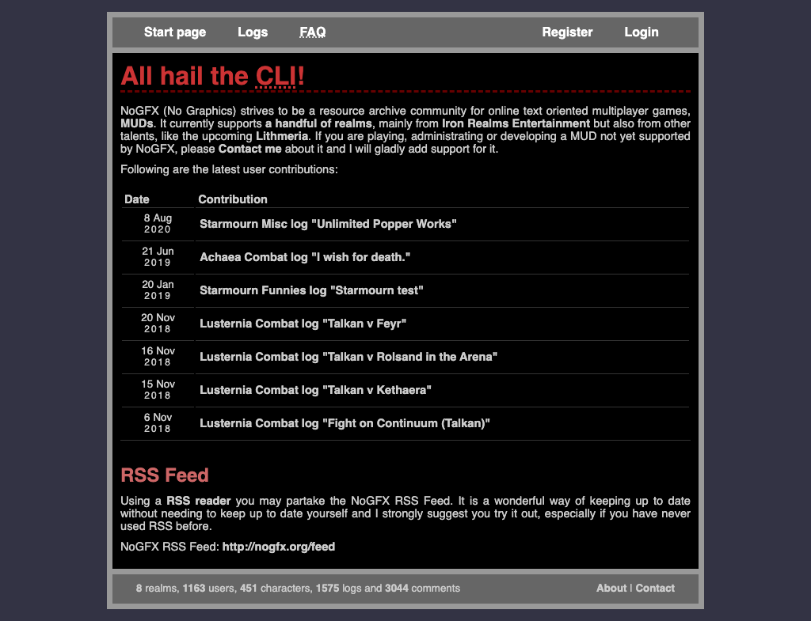
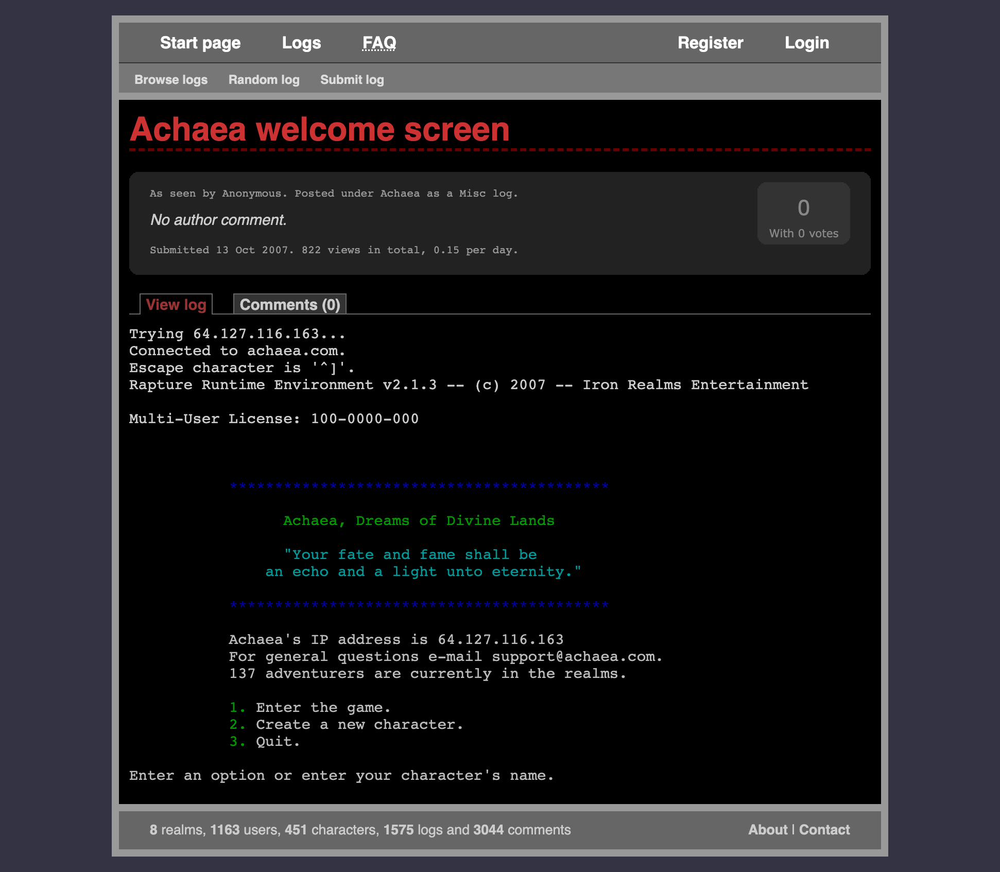
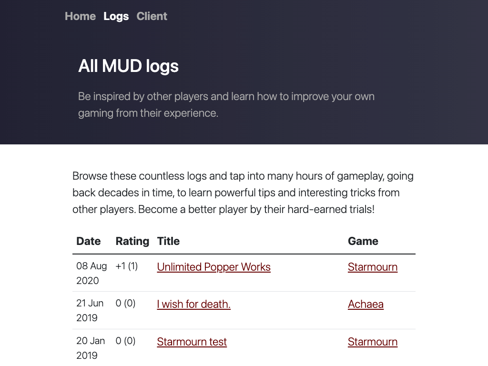
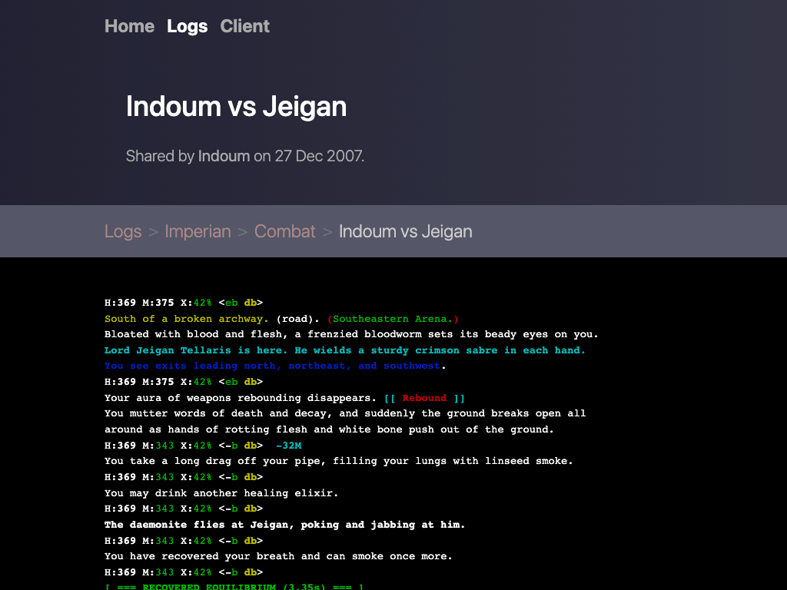
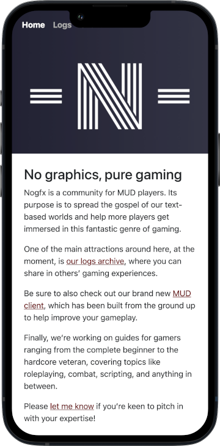
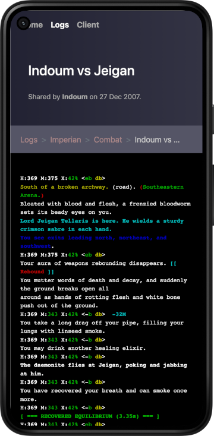

+++
title = 'Nogfx is back!'
intro = "After a looong hiatus, we're finally back. This time with some extras."
+++

The first version of this website saw the light of day back in 2006. It was a very simple piece of software, where you could upload a log from your MUD gaming session, to more easily share your experience.

Like a geekier predecessor to Twitch. (Except, for some reason, Amazon never offered _me_ a nine-figure acquisition offer… Still waiting, Jeff!)

Over the years I kept adding features – character verification, voting, commenting, etc. It was still all very basic, as is evident from these old screenshots of what it looked like.

  

    <figure class="figure mb-0">
      
    </figure>
  

  

    <figure class="figure mb-0">
      
    </figure>
  

Boxed-in design was in vugue back then, okay?!

Regardless of the crappy looks and half-working features, people seemed to like the website. As time went by, together we managed to share more than 1500 logs and create over 3000 comments.

Then, life happened and I no longer had the time to play MUDs. While Nogfx kept living its own life, over time, stuff broke down and stopped working and the website saw an ever decreasing usage.

MUDding has a special place in my heart, though, having cut my teeth on coding for them, which turned into my professional career. I've got so many fond memories from playing these games, meeting people from all over the world, and building something together.

(Or killing each other repeatedly through intense all-nighters.)

All this time I've wanted to do something to turn this project around.

So when I recently found myself with a tiny bit of extra spare time, I decided to breathe new life into Nogfx, revamping the website and hopefully making it even more useful for our community.

A few weeks later I can proudly announce that step one is done! The website is rebuilt from scratch and there's a lot of news in this version.

Let's look at them in turn.

_Psst! Be sure to [subscribe to the newsletter](/subscribe/) and I'll let you know when I make updates or have more news to share._

## New design

As you might have noticed, this revamp started with a new design for the website. I'm by no means a good designer but at least I'm better than I was one and a half decade ago, comparing to the above screenshots.

  

    <figure class="figure mb-0">
      
    </figure>
  

  

    <figure class="figure mb-0">
      
    </figure>
  

Design has never really been my forte but I'm happy with the improvement!

Besides making it easier on the eyes, this new design also works just as well on a mobile device. You kind of expect that, this side of 2010, but that certainly didn't use to be the case with the old Nogfx.

  

    <figure class="figure mb-0">
      
    </figure>
  

  

    <figure class="figure mb-0">
      
    </figure>
  

Design has never really been my forte but I'm happy with the improvement!

While I'm quite happy with the visual side of things, there are still some features missing behind the scenes. You currently can't upload logs, create new accounts, register and verify characters, etc, etc.

In order to meet my self-imposed deadline, I've put the website in read-only mode. You can still browse [the massive log archive](/logs/) and read all the comments but, right now, there's no easy way to add new ones.

That brings me to the next item.

## Free and open source

This website is now free and released as open-source!

 This means that I no longer have to be the bottleneck for its continued development. If you see something that you want to fix, add, remove, or otherwise improve, feel free to!

The source code is [up on GitHub](https://github.com/tobiassjosten/nogfx-web) and ready for your pull requests. I have fully automated the release process, so a literal click of a button is all it takes to publish your changes for the world to see.

That's currently the only way to add content. You'll soon be able to upload logs directly on the website and comment on them here, like it used to be, but I wanted to get something out before digging into that.

Plus, I've got some ambitious ideas for the logs section which will take this to a whole new level. Stay tuned for that!

Speaking of surprises, let's move on to the next piece of news.

## New MUD client

I make it no secret that the programming and technical puzzle aspect of playing MUDs is one of my strongest drives. Coding my own client-side logic is how I initially got into software engineering as a profession.

I've always had this itch, though, of something left unfulfilled.

Failing to properly scratch it back in 2009, with [my Protea project](https://github.com/tobiassjosten/protea), a few months ago I renewed my efforts. This time armed with sharpened skills and a huge backpack of experience.

There are a lot of great clients out there but nothing that checked every box of mine. I wanted something that I could use in my terminal, would run blazing fast, and have a deep integration with the games I play.

So I decided to build my own. Meet [the Nogfx MUD client](/client/)!

Built in Go and also relased as open source, it sports a lot of features already and is fully usable for gaming, ticking all of my boxes above.

It's opinionated, making decisions for the user instead of encumbering them with yet more configuration options. It also has some novel takes on text processing, data structures, and logic implementation, paving the way for some interesting features in the future.

I'm very excited about this project and hope you'll like it too!

## New ambitions

Going forward, I have a million ideas I want to implement. For example:

*More metadata for logs.* Imagine being able to pull upp all combat logs against Depthwalkers in Achaea to study how to counter them better.

*Streaming logs.* I'd love to watch top players duke it out in real time!

*Centralized documentation.* Making the rich, but very much scattered information from in-game help files and scrolls more accessible.

*Guides and analyses.* Digging into a topic and helping more people understand it better, so we can improve together.

… and much, much more. But one thing at a time. :)

All in all, I want Nogfx to help more people discover this wonderful world of ours and help players get out of online text-based games.

And I'd love for you to [join me](/subscribe/) on this journey!
